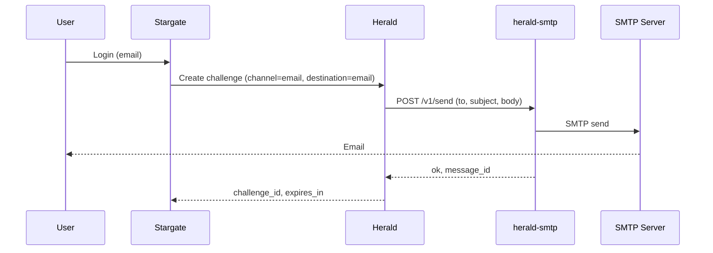

# herald-smtp

[](LICENSE)
[](https://golang.org)
[](https://goreportcard.com/report/github.com/soulteary/herald-smtp)

## Multi-language Documentation

- [English](README.md) | [中文](README.zhCN.md)

SMTP email adapter for [Herald](https://github.com/soulteary/herald). Herald forwards verification codes over HTTP to this service; herald-smtp sends email via SMTP. All SMTP credentials and sending logic live in this project only—Herald does not hold any SMTP credentials when using herald-smtp.

## Core Features

- **Herald HTTP Provider contract**: Implements the same HTTP send contract as Herald's external provider; request/response align with [provider-kit](https://github.com/soulteary/provider-kit) `HTTPSendRequest` / `HTTPSendResponse`.
- **Optional API Key auth**: When `API_KEY` is set, Herald must send `X-API-Key`; otherwise no auth required.
- **Idempotency**: Supports `Idempotency-Key` (or body `idempotency_key`); same key within TTL returns cached result without sending again.
- **Graceful shutdown**: On `SIGINT` or `SIGTERM`, server stops accepting new requests and shuts down with a 10s timeout.

## Architecture



- **Stargate**: ForwardAuth / login orchestration.
- **Herald**: OTP challenge creation and verification; calls herald-smtp for channel `email` when `HERALD_SMTP_API_URL` is set.
- **herald-smtp**: HTTP adapter; sends email via SMTP; holds SMTP credentials only here.

## Protocol

- **POST /v1/send**  
  Request: `channel` (e.g. `email`), `to` (email address), `subject`, `body` (or `params.code`), `idempotency_key`, optional `template`/`params`/`locale`.  
  Response: `{ "ok": true, "message_id": "...", "provider": "smtp" }` or `{ "ok": false, "error_code": "...", "error_message": "..." }`.
- **GET /healthz**: `{ "status": "healthy", "service": "herald-smtp" }` (via [health-kit](https://github.com/soulteary/health-kit)).

## Configuration

| Variable | Description | Default | Required |
|----------|-------------|---------|----------|
| `PORT` | Listen port (with or without leading colon) | `:8084` | No |
| `API_KEY` | If set, Herald must send `X-API-Key` | `` | No |
| `SMTP_HOST` | SMTP server host | `` | Yes (for send) |
| `SMTP_PORT` | SMTP server port | `587` | No |
| `SMTP_USER` | SMTP username | `` | No (if server allows anonymous) |
| `SMTP_PASSWORD` | SMTP password | `` | No |
| `SMTP_FROM` | Sender email address | `` | Yes (for send) |
| `SMTP_USE_STARTTLS` | Use STARTTLS | `true` | No |
| `LOG_LEVEL` | Log level: trace, debug, info, warn, error | `info` | No |
| `IDEMPOTENCY_TTL_SECONDS` | Idempotency cache TTL (seconds) | `300` | No |

## Herald side

Configure Herald with HTTP provider for channel `email` (instead of built-in SMTP):

- `HERALD_SMTP_API_URL` = base URL of herald-smtp (e.g. `http://herald-smtp:8084`)
- Optional: `HERALD_SMTP_API_KEY` = same as herald-smtp `API_KEY`

When `HERALD_SMTP_API_URL` is set, Herald does not use built-in SMTP (no `SMTP_HOST` in Herald).

## Quick Start

### Build & run (binary)

```bash
go build -o herald-smtp .
./herald-smtp
```

With SMTP credentials in env, `POST /v1/send` will send email to the given address.

### Run with Docker

```bash
docker build -t herald-smtp .
docker run -d --name herald-smtp -p 8084:8084 \
  -e SMTP_HOST=smtp.example.com \
  -e SMTP_FROM=noreply@example.com \
  -e SMTP_USER=user \
  -e SMTP_PASSWORD=secret \
  herald-smtp
```

Optional: add `-e API_KEY=your_shared_secret` and set `HERALD_SMTP_API_KEY` to the same value on Herald.

## Documentation

- **[Documentation Index (English)](docs/enUS/README.md)** – [API](docs/enUS/API.md) | [Deployment](docs/enUS/DEPLOYMENT.md) | [Troubleshooting](docs/enUS/TROUBLESHOOTING.md) | [Security](docs/enUS/SECURITY.md)
- **[文档索引（中文）](docs/zhCN/README.md)** – [API](docs/zhCN/API.md) | [部署](docs/zhCN/DEPLOYMENT.md) | [故障排查](docs/zhCN/TROUBLESHOOTING.md) | [安全](docs/zhCN/SECURITY.md)

## Testing

```bash
go test ./...
```

## License

See [LICENSE](LICENSE) for details.
