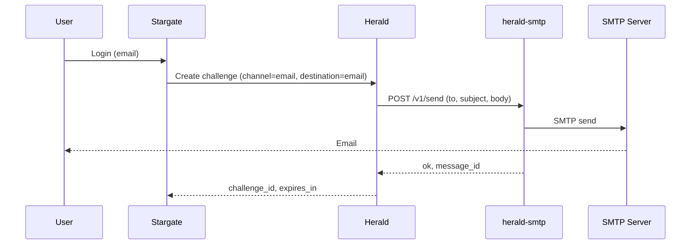

# herald-smtp

[](LICENSE)
[](https://golang.org)
[](.github/goreportcard-report.md)

## Multi-language Documentation

- [English](README.md) | [中文](README.zhCN.md)

SMTP email adapter for [Herald](https://github.com/soulteary/herald). Herald forwards verification codes over HTTP to this service; herald-smtp sends email via SMTP. All SMTP credentials and sending logic live in this project only—Herald does not hold any SMTP credentials when using herald-smtp.

The HTTP server uses Fiber v3 and the matching v2 module lines of the Fiber-facing kit packages. Building from source requires Go 1.26 or later.

## Core Features

- **Herald HTTP Provider contract**: Implements the same HTTP send contract as Herald's external provider; request/response align with [provider-kit](https://github.com/soulteary/provider-kit) `HTTPSendRequest` / `HTTPSendResponse`.
- **Optional API Key auth**: When `API_KEY` is set, Herald must send `X-API-Key`; otherwise no auth required.
- **Idempotency**: Supports `Idempotency-Key` (or body `idempotency_key`, maximum 256 bytes); requests with the same key and content share one SMTP send within a single process, and successful results are cached for the configured TTL.
- **SMTP transport modes**: Supports plaintext SMTP, STARTTLS, and implicit TLS with bounded send timeouts.
- **Graceful shutdown**: On `SIGINT` or `SIGTERM`, server stops accepting new requests and shuts down with a 10s timeout.

## Architecture


```mermaid
sequenceDiagram
  participant User
  participant Stargate
  participant Herald
  participant HeraldSMTP as herald-smtp
  participant SMTP as SMTP Server

  User->>Stargate: Login (email)
  Stargate->>Herald: Create challenge (channel=email, destination=email)
  Herald->>HeraldSMTP: POST /v1/send (to, subject, body)
  HeraldSMTP->>SMTP: SMTP send
  SMTP-->>User: Email
  HeraldSMTP-->>Herald: ok, message_id
  Herald-->>Stargate: challenge_id, expires_in
```

- **Stargate**: ForwardAuth / login orchestration.
- **Herald**: OTP challenge creation and verification; calls herald-smtp for channel `email` when `HERALD_SMTP_API_URL` is set.
- **herald-smtp**: HTTP adapter; sends email via SMTP; holds SMTP credentials only here.

## Protocol

- **POST /v1/send**  
  Request: `channel` (e.g. `email`), `to` (email address), `subject`, `body` (or `params.code`), `idempotency_key`, optional `template`/`params`/`locale`.  
  Response: `{ "ok": true, "message_id": "...", "provider": "smtp" }` or `{ "ok": false, "error_code": "...", "error_message": "..." }`.
- **GET /healthz**: Liveness endpoint returning `{ "status": "healthy", "service": "herald-smtp" }`. It does not test SMTP configuration or connectivity.
- **GET /readyz**: Readiness endpoint. It returns `200` after the SMTP client is initialized and `503` when SMTP configuration is missing or invalid.

## Essential Configuration

| Variable | Description | Default | Required |
|----------|-------------|---------|----------|
| `PORT` | Listen port (with or without leading colon) | `:8084` | No |
| `API_KEY` | If set, Herald must send `X-API-Key` | `` | No |
| `SMTP_HOST` | SMTP server host | `` | Yes (for send) |
| `SMTP_PORT` | SMTP server port | `587` | No |
| `SMTP_USER` | SMTP username | `` | No (if server allows anonymous) |
| `SMTP_PASSWORD` | SMTP password | `` | No |
| `SMTP_FROM` | Sender email address | `` | Yes (for send) |
| `SMTP_FROM_NAME` | Optional sender display name | `` | No |
| `SMTP_USE_TLS` | Use implicit TLS (typically port 465) | `false` | No |
| `SMTP_USE_STARTTLS` | Use STARTTLS | `true` | No |

See the [deployment guide](docs/enUS/DEPLOYMENT.md#environment-variables) for TLS modes, timeouts, request limits, idempotency limits, and the complete environment-variable reference.

## Herald side

Configure Herald with HTTP provider for channel `email` (instead of built-in SMTP):

- `HERALD_SMTP_API_URL` = base URL of herald-smtp (e.g. `http://herald-smtp:8084`)
- Optional: `HERALD_SMTP_API_KEY` = same as herald-smtp `API_KEY`

When `HERALD_SMTP_API_URL` is set, Herald does not use built-in SMTP (no `SMTP_HOST` in Herald).

## Quick Start

### Build and run

```bash
export SMTP_HOST=smtp.example.com
export SMTP_PORT=587
export SMTP_FROM=noreply@example.com
export SMTP_USER=user
export SMTP_PASSWORD=secret
export API_KEY=replace-with-a-strong-random-value

go build -o herald-smtp .
./herald-smtp
```

In another terminal, verify liveness and send a test request:

```bash
curl -sS http://localhost:8084/healthz

curl -sS -X POST http://localhost:8084/v1/send \
  -H 'Content-Type: application/json' \
  -H 'X-API-Key: replace-with-a-strong-random-value' \
  -H 'Idempotency-Key: quickstart-001' \
  -d '{"to":"recipient@example.com","subject":"Test","body":"Hello from herald-smtp"}'
```

Replace the example host, credentials, sender, recipient, and API key before use. A successful `/healthz` response only confirms that the process is running; it does not prove that SMTP sending works.

### Run with Docker

```bash
docker build -t herald-smtp .
docker run -d --name herald-smtp -p 8084:8084 \
  -e SMTP_HOST=smtp.example.com \
  -e SMTP_FROM=noreply@example.com \
  -e SMTP_USER=user \
  -e SMTP_PASSWORD=secret \
  herald-smtp
```

Optional: add `-e API_KEY=your_shared_secret` and set `HERALD_SMTP_API_KEY` to the same value on Herald.

> **Scaling note:** idempotency state is held in process memory. Multiple replicas do not share cached keys, so the same request routed to different replicas can be sent more than once. Use one replica unless the caller provides a shared idempotency layer.

## Documentation

- **[Documentation Index (English)](docs/enUS/README.md)** – [API](docs/enUS/API.md) | [Deployment](docs/enUS/DEPLOYMENT.md) | [Troubleshooting](docs/enUS/TROUBLESHOOTING.md) | [Security](docs/enUS/SECURITY.md)
- **[文档索引（中文）](docs/zhCN/README.md)** – [API](docs/zhCN/API.md) | [部署](docs/zhCN/DEPLOYMENT.md) | [故障排查](docs/zhCN/TROUBLESHOOTING.md) | [安全](docs/zhCN/SECURITY.md)

## Testing

```bash
go test -race -cover ./...
```

## License

See [LICENSE](LICENSE) for details. Notable release changes are recorded in [CHANGELOG.md](CHANGELOG.md).
