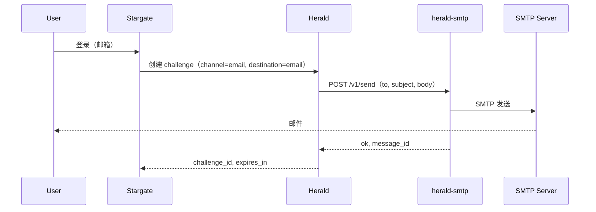

# herald-smtp

[](LICENSE)
[](https://golang.org)
[](https://goreportcard.com/report/github.com/soulteary/herald-smtp)

## 多语言文档

- [English](README.md) | [中文](README.zhCN.md)

herald-smtp 是 [Herald](https://github.com/soulteary/herald) 的 SMTP 邮件适配器。Herald 通过 HTTP 将验证码发送请求转发到本服务，本服务再通过 SMTP 发送邮件。使用 herald-smtp 时，所有 SMTP 凭证与发送逻辑仅存在于本项目中，Herald 不保存任何 SMTP 凭证。

## 核心特性

- **与 Herald HTTP Provider 协议一致**：实现 Herald 外部 Provider 的 HTTP 发送契约，请求/响应与 [provider-kit](https://github.com/soulteary/provider-kit) 的 `HTTPSendRequest` / `HTTPSendResponse` 对齐。
- **可选 API Key 鉴权**：配置 `API_KEY` 后，Herald 需在请求头中携带 `X-API-Key`；未配置则无需鉴权。
- **幂等**：支持 `Idempotency-Key`（或 body 中的 `idempotency_key`），TTL 内相同 key 直接返回缓存结果，不再重复发送。
- **优雅关闭**：收到 `SIGINT` 或 `SIGTERM` 后停止接收新请求，并在 10 秒超时内完成关闭。

## 架构



- **Stargate**：ForwardAuth / 登录编排。
- **Herald**：OTP challenge 创建与校验；当配置 `HERALD_SMTP_API_URL` 时对 channel `email` 调用 herald-smtp。
- **herald-smtp**：HTTP 适配层；通过 SMTP 发送邮件；仅在本服务持有 SMTP 凭证。

## 协议

- **POST /v1/send**  
  请求：`channel`（如 `email`）、`to`（邮箱地址）、`subject`、`body`（或 `params.code`）、`idempotency_key`，可选 `template`/`params`/`locale`。  
  响应：`{ "ok": true, "message_id": "...", "provider": "smtp" }` 或 `{ "ok": false, "error_code": "...", "error_message": "..." }`。
- **GET /healthz**：`{ "status": "healthy", "service": "herald-smtp" }`（通过 [health-kit](https://github.com/soulteary/health-kit)）。

## 配置

| 变量 | 说明 | 默认值 | 必填 |
|------|------|--------|------|
| `PORT` | 监听端口（可带或不带冒号） | `:8084` | 否 |
| `API_KEY` | 若设置，Herald 需在请求头中携带 `X-API-Key` | `` | 否 |
| `SMTP_HOST` | SMTP 服务器主机 | `` | 是（发送时） |
| `SMTP_PORT` | SMTP 端口 | `587` | 否 |
| `SMTP_USER` | SMTP 用户名 | `` | 否（若服务器允许匿名） |
| `SMTP_PASSWORD` | SMTP 密码 | `` | 否 |
| `SMTP_FROM` | 发件人邮箱地址 | `` | 是（发送时） |
| `SMTP_USE_STARTTLS` | 使用 STARTTLS | `true` | 否 |
| `LOG_LEVEL` | 日志级别：trace, debug, info, warn, error | `info` | 否 |
| `IDEMPOTENCY_TTL_SECONDS` | 幂等缓存 TTL（秒） | `300` | 否 |

## Herald 侧配置

在 Herald 中为 channel `email` 配置 HTTP Provider（替代内置 SMTP）：

- `HERALD_SMTP_API_URL` = herald-smtp 的 Base URL（例如 `http://herald-smtp:8084`）
- 可选：`HERALD_SMTP_API_KEY` = 与 herald-smtp 的 `API_KEY` 相同

设置 `HERALD_SMTP_API_URL` 后，Herald 不再使用内置 SMTP（Herald 中无需配置 `SMTP_HOST`）。

## 快速开始

### 构建与运行（二进制）

```bash
go build -o herald-smtp .
./herald-smtp
```

在环境变量中配置 SMTP 凭证后，`POST /v1/send` 会向指定邮箱发送邮件。

### 使用 Docker 运行

```bash
docker build -t herald-smtp .
docker run -d --name herald-smtp -p 8084:8084 \
  -e SMTP_HOST=smtp.example.com \
  -e SMTP_FROM=noreply@example.com \
  -e SMTP_USER=user \
  -e SMTP_PASSWORD=secret \
  herald-smtp
```

可选：增加 `-e API_KEY=your_shared_secret`，并在 Herald 侧将 `HERALD_SMTP_API_KEY` 设为相同值。

## 文档

- **[Documentation Index (English)](docs/enUS/README.md)** – [API](docs/enUS/API.md) | [Deployment](docs/enUS/DEPLOYMENT.md) | [Troubleshooting](docs/enUS/TROUBLESHOOTING.md) | [Security](docs/enUS/SECURITY.md)
- **[文档索引（中文）](docs/zhCN/README.md)** – [API](docs/zhCN/API.md) | [部署](docs/zhCN/DEPLOYMENT.md) | [故障排查](docs/zhCN/TROUBLESHOOTING.md) | [安全](docs/zhCN/SECURITY.md)

## 测试

```bash
go test ./...
```

## 许可证

详见 [LICENSE](LICENSE)。
