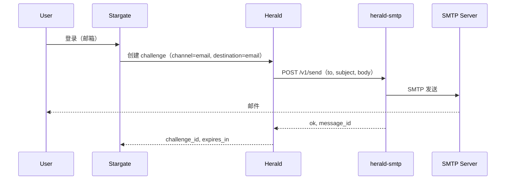

# herald-smtp

[](LICENSE)
[](https://golang.org)
[](.github/goreportcard-report.md)

## 多语言文档

- [English](README.md) | [中文](README.zhCN.md)

herald-smtp 是 [Herald](https://github.com/soulteary/herald) 的 SMTP 邮件适配器。Herald 通过 HTTP 将验证码发送请求转发到本服务，本服务再通过 SMTP 发送邮件。使用 herald-smtp 时，所有 SMTP 凭证与发送逻辑仅存在于本项目中，Herald 不保存任何 SMTP 凭证。

HTTP 服务使用 Fiber v3.4.0 及与之匹配的 Fiber 相关 kit v2 模块版本。从源码构建需要 Go 1.26 或更高版本。

## 核心特性

- **与 Herald HTTP Provider 协议一致**：实现 Herald 外部 Provider 的 HTTP 发送契约，请求/响应与 [provider-kit](https://github.com/soulteary/provider-kit) 的 `HTTPSendRequest` / `HTTPSendResponse` 对齐。
- **可选 API Key 鉴权**：配置 `API_KEY` 后，Herald 需在请求头中携带 `X-API-Key`；未配置则无需鉴权。
- **幂等**：支持 `Idempotency-Key`（或 body 中的 `idempotency_key`，最长 256 字节）；在单个进程内，相同 key 和内容的请求共用一次 SMTP 发送，成功结果在配置的 TTL 内缓存。
- **SMTP 传输模式**：支持明文 SMTP、STARTTLS 和隐式 TLS，并对完整发送过程设置超时。
- **优雅关闭**：收到 `SIGINT` 或 `SIGTERM` 后停止接收新请求，并在 10 秒超时内完成关闭。

## 架构


```mermaid
sequenceDiagram
  participant User
  participant Stargate
  participant Herald
  participant HeraldSMTP as herald-smtp
  participant SMTP as SMTP Server

  User->>Stargate: 登录（邮箱）
  Stargate->>Herald: 创建 challenge（channel=email, destination=email）
  Herald->>HeraldSMTP: POST /v1/send（to, subject, body）
  HeraldSMTP->>SMTP: SMTP 发送
  SMTP-->>User: 邮件
  HeraldSMTP-->>Herald: ok, message_id
  Herald-->>Stargate: challenge_id, expires_in
```

- **Stargate**：ForwardAuth / 登录编排。
- **Herald**：OTP challenge 创建与校验；当配置 `HERALD_SMTP_API_URL` 时对 channel `email` 调用 herald-smtp。
- **herald-smtp**：HTTP 适配层；通过 SMTP 发送邮件；仅在本服务持有 SMTP 凭证。

## 协议

- **POST /v1/send**  
  请求：`channel`（如 `email`）、`to`（邮箱地址）、`subject`、`body`（或 `params.code`）、`idempotency_key`，可选 `template`/`params`/`locale`。  
  响应：`{ "ok": true, "message_id": "...", "provider": "smtp" }` 或 `{ "ok": false, "error_code": "...", "error_message": "..." }`。
- **GET /healthz**：存活检查端点，返回 `{ "status": "healthy", "service": "herald-smtp" }`；不会检查 SMTP 配置或连通性。

## 基础配置

| 变量 | 说明 | 默认值 | 必填 |
|------|------|--------|------|
| `PORT` | 监听端口（可带或不带冒号） | `:8084` | 否 |
| `API_KEY` | 若设置，Herald 需在请求头中携带 `X-API-Key` | `` | 否 |
| `SMTP_HOST` | SMTP 服务器主机 | `` | 是（发送时） |
| `SMTP_PORT` | SMTP 端口 | `587` | 否 |
| `SMTP_USER` | SMTP 用户名 | `` | 否（若服务器允许匿名） |
| `SMTP_PASSWORD` | SMTP 密码 | `` | 否 |
| `SMTP_FROM` | 发件人邮箱地址 | `` | 是（发送时） |
| `SMTP_FROM_NAME` | 可选的发件人显示名称 | `` | 否 |
| `SMTP_USE_TLS` | 使用隐式 TLS（通常为 465 端口） | `false` | 否 |
| `SMTP_USE_STARTTLS` | 使用 STARTTLS | `true` | 否 |

TLS 模式、超时、请求大小、幂等容量和全部环境变量请参阅[部署指南](docs/zhCN/DEPLOYMENT.md#环境变量)。

## Herald 侧配置

在 Herald 中为 channel `email` 配置 HTTP Provider（替代内置 SMTP）：

- `HERALD_SMTP_API_URL` = herald-smtp 的 Base URL（例如 `http://herald-smtp:8084`）
- 可选：`HERALD_SMTP_API_KEY` = 与 herald-smtp 的 `API_KEY` 相同

设置 `HERALD_SMTP_API_URL` 后，Herald 不再使用内置 SMTP（Herald 中无需配置 `SMTP_HOST`）。

## 快速开始

### 构建与运行

```bash
export SMTP_HOST=smtp.example.com
export SMTP_PORT=587
export SMTP_FROM=noreply@example.com
export SMTP_USER=user
export SMTP_PASSWORD=secret
export API_KEY=replace-with-a-strong-random-value

go build -o herald-smtp .
./herald-smtp
```

在另一个终端检查进程并发送测试请求：

```bash
curl -sS http://localhost:8084/healthz

curl -sS -X POST http://localhost:8084/v1/send \
  -H 'Content-Type: application/json' \
  -H 'X-API-Key: replace-with-a-strong-random-value' \
  -H 'Idempotency-Key: quickstart-001' \
  -d '{"to":"recipient@example.com","subject":"Test","body":"Hello from herald-smtp"}'
```

使用前请替换示例主机、凭证、发件人、收件人和 API Key。`/healthz` 成功只表示进程正在运行，不代表 SMTP 一定可以发送。

### 使用 Docker 运行

```bash
docker build -t herald-smtp .
docker run -d --name herald-smtp -p 8084:8084 \
  -e SMTP_HOST=smtp.example.com \
  -e SMTP_FROM=noreply@example.com \
  -e SMTP_USER=user \
  -e SMTP_PASSWORD=secret \
  herald-smtp
```

可选：增加 `-e API_KEY=your_shared_secret`，并在 Herald 侧将 `HERALD_SMTP_API_KEY` 设为相同值。

> **扩容说明：** 幂等状态保存在进程内存中。多个副本之间不共享缓存，同一请求被路由到不同实例时仍可能重复发送。除非调用方提供共享幂等层，否则建议运行单副本。

## 文档

- **[Documentation Index (English)](docs/enUS/README.md)** – [API](docs/enUS/API.md) | [Deployment](docs/enUS/DEPLOYMENT.md) | [Troubleshooting](docs/enUS/TROUBLESHOOTING.md) | [Security](docs/enUS/SECURITY.md)
- **[文档索引（中文）](docs/zhCN/README.md)** – [API](docs/zhCN/API.md) | [部署](docs/zhCN/DEPLOYMENT.md) | [故障排查](docs/zhCN/TROUBLESHOOTING.md) | [安全](docs/zhCN/SECURITY.md)

## 测试

```bash
go test -race -cover ./...
```

## 许可证

详见 [LICENSE](LICENSE)。
