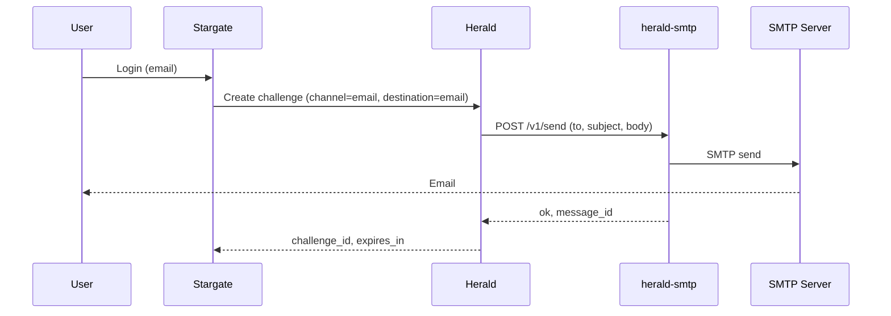

# herald-smtp Deployment Guide

## Quick Start

### Binary

```bash
# Build
go build -o herald-smtp .

# Run (set SMTP env vars first)
./herald-smtp
```

### Docker

```bash
# Build image
docker build -t herald-smtp .

# Run with env vars
docker run -d --name herald-smtp -p 8084:8084 \
  -e SMTP_HOST=smtp.example.com \
  -e SMTP_FROM=noreply@example.com \
  -e SMTP_USER=user \
  -e SMTP_PASSWORD=secret \
  herald-smtp
```

Optional: if you use `API_KEY` on herald-smtp, pass it and use the same value in Herald as `HERALD_SMTP_API_KEY`:

```bash
docker run -d --name herald-smtp -p 8084:8084 \
  -e API_KEY=your_shared_secret \
  -e SMTP_HOST=smtp.example.com \
  -e SMTP_FROM=noreply@example.com \
  -e SMTP_USER=user \
  -e SMTP_PASSWORD=secret \
  herald-smtp
```

### Docker Compose (example)

Minimal example for herald-smtp only:

```yaml
services:
  herald-smtp:
    image: herald-smtp:latest
    build: .
    ports:
      - "8084:8084"
    environment:
      - PORT=:8084
      - SMTP_HOST=${SMTP_HOST}
      - SMTP_FROM=${SMTP_FROM}
      - SMTP_USER=${SMTP_USER}
      - SMTP_PASSWORD=${SMTP_PASSWORD}
      # Optional:
      # - API_KEY=${API_KEY}
      # - LOG_LEVEL=info
      # - IDEMPOTENCY_TTL_SECONDS=300
```

## Configuration

### Environment Variables

| Variable | Description | Default | Required |
|----------|-------------|---------|----------|
| `PORT` | Listen port (with or without leading colon, e.g. `8084` or `:8084`) | `:8084` | No |
| `API_KEY` | If set, callers must send `X-API-Key` with this value | `` | No |
| `SMTP_HOST` | SMTP server host | `` | Yes (for send) |
| `SMTP_PORT` | SMTP server port | `587` | No |
| `SMTP_USER` | SMTP username | `` | No (if server allows anonymous) |
| `SMTP_PASSWORD` | SMTP password | `` | No |
| `SMTP_FROM` | Sender email address | `` | Yes (for send) |
| `SMTP_USE_STARTTLS` | Use STARTTLS | `true` | No |
| `LOG_LEVEL` | Log level: trace, debug, info, warn, error | `info` | No |
| `IDEMPOTENCY_TTL_SECONDS` | Idempotency cache TTL in seconds | `300` | No |

When `SMTP_HOST` or `SMTP_FROM` is missing, `POST /v1/send` returns `503` with `error_code: "provider_down"`.

## Integration with Herald

Herald calls herald-smtp over HTTP when the OTP channel is `email` and `HERALD_SMTP_API_URL` is set. Configure Herald with:

- **`HERALD_SMTP_API_URL`** – Base URL of herald-smtp (e.g. `http://herald-smtp:8084`).
- **`HERALD_SMTP_API_KEY`** (optional) – Same value as herald-smtp `API_KEY`; Herald will send it as `X-API-Key`.

When `HERALD_SMTP_API_URL` is set, Herald does not use built-in SMTP (no `SMTP_HOST` in Herald). All SMTP credentials live only in herald-smtp.

### Data flow



High-level architecture:

- **Stargate**: ForwardAuth / login orchestration.
- **Herald**: OTP challenge creation and verification; calls herald-smtp for `email` channel when `HERALD_SMTP_API_URL` is set.
- **herald-smtp**: HTTP adapter; sends email via SMTP; holds SMTP credentials.
