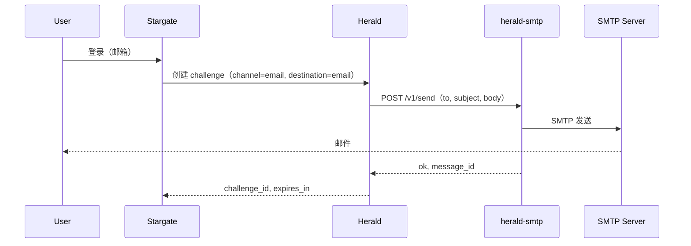

# herald-smtp 部署指南

## 快速开始

### 二进制

```bash
# 构建
go build -o herald-smtp .

# 运行（先设置 SMTP 环境变量）
./herald-smtp
```

### Docker

```bash
# 构建镜像
docker build -t herald-smtp .

# 运行并传入环境变量
docker run -d --name herald-smtp -p 8084:8084 \
  -e SMTP_HOST=smtp.example.com \
  -e SMTP_FROM=noreply@example.com \
  -e SMTP_USER=user \
  -e SMTP_PASSWORD=secret \
  herald-smtp
```

可选：若在 herald-smtp 上配置了 `API_KEY`，传入该值并在 Herald 侧将 `HERALD_SMTP_API_KEY` 设为相同值：

```bash
docker run -d --name herald-smtp -p 8084:8084 \
  -e API_KEY=your_shared_secret \
  -e SMTP_HOST=smtp.example.com \
  -e SMTP_FROM=noreply@example.com \
  -e SMTP_USER=user \
  -e SMTP_PASSWORD=secret \
  herald-smtp
```

## 配置

### 环境变量

| 变量 | 说明 | 默认值 | 必填 |
|------|------|--------|------|
| `PORT` | 监听端口（可带或不带冒号，如 `8084` 或 `:8084`） | `:8084` | 否 |
| `API_KEY` | 若设置，调用方需在 `X-API-Key` 中传此值 | `` | 否 |
| `SMTP_HOST` | SMTP 服务器主机 | `` | 是（发送时） |
| `SMTP_PORT` | SMTP 端口 | `587` | 否 |
| `SMTP_USER` | SMTP 用户名 | `` | 否（若服务器允许匿名） |
| `SMTP_PASSWORD` | SMTP 密码 | `` | 否 |
| `SMTP_FROM` | 发件人邮箱地址 | `` | 是（发送时） |
| `SMTP_USE_STARTTLS` | 使用 STARTTLS | `true` | 否 |
| `LOG_LEVEL` | 日志级别：trace, debug, info, warn, error | `info` | 否 |
| `IDEMPOTENCY_TTL_SECONDS` | 幂等缓存 TTL（秒） | `300` | 否 |

当 `SMTP_HOST` 或 `SMTP_FROM` 缺失时，`POST /v1/send` 返回 `503`，`error_code` 为 `"provider_down"`。

## 与 Herald 集成

当 OTP 通道为 `email` 且 Herald 配置了 `HERALD_SMTP_API_URL` 时，Herald 通过 HTTP 调用 herald-smtp。在 Herald 中配置：

- **`HERALD_SMTP_API_URL`** – herald-smtp 的 Base URL（例如 `http://herald-smtp:8084`）。
- **`HERALD_SMTP_API_KEY`**（可选） – 与 herald-smtp 的 `API_KEY` 相同；Herald 会将其放在 `X-API-Key` 中发送。

设置 `HERALD_SMTP_API_URL` 后，Herald 不再使用内置 SMTP（Herald 中无需配置 `SMTP_HOST`）。所有 SMTP 凭证仅存在于 herald-smtp。

### 数据流



高层架构：

- **Stargate**：ForwardAuth / 登录编排。
- **Herald**：OTP challenge 创建与校验；当配置 `HERALD_SMTP_API_URL` 时对 channel `email` 调用 herald-smtp。
- **herald-smtp**：HTTP 适配层；通过 SMTP 发送邮件；持有 SMTP 凭证。
